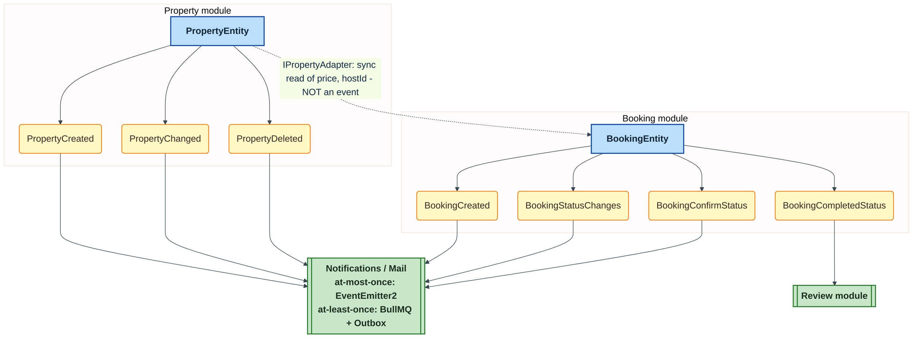
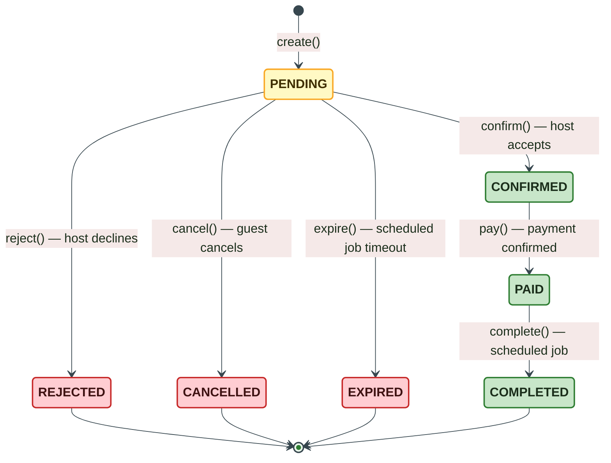
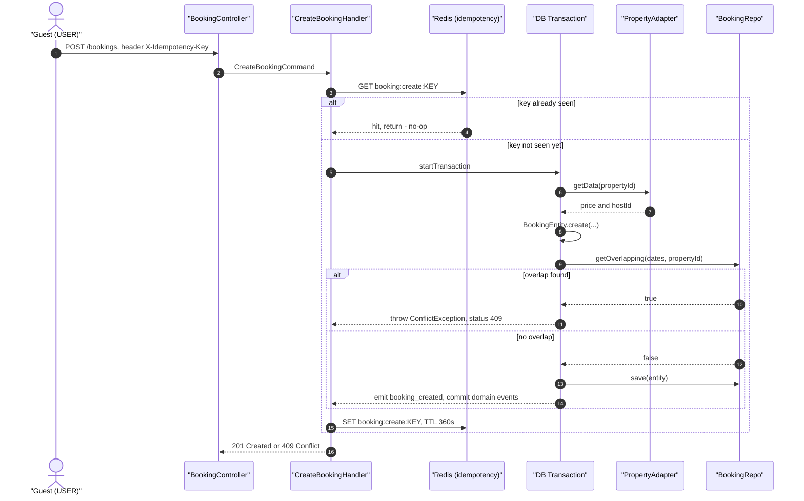

# Booking Platform API

A production-ready REST API for a property booking platform — hosts list properties, guests browse and book them, with integrated payments, real-time chat, notifications, and file storage.

> **Status:** Backend API is feature-complete. Frontend is out of scope — Swagger UI serves as the interface

---

## Table of Contents

- [Tech Stack](#tech-stack)
- [Architecture](#architecture)
- [Architecture Decisions](#architecture-decisions)
- [Auth Flow](#auth-flow)
- [Property Lifecycle](#property-lifecycle)
- [Booking Lifecycle](#booking-lifecycle)
- [Modules](#modules)
- [Getting Started](#getting-started)
- [Environment Variables](#environment-variables)
- [API Documentation](#api-documentation)
- [Project Structure](#project-structure)
- [Running Tests](#running-tests)
- [Roadmap / Possible Improvements](#roadmap--possible-improvements)

---

## Tech Stack

| Layer | Technology |
|---|---|
| Runtime | Node.js + NestJS v11 |
| Language | TypeScript 5.7 |
| Database | PostgreSQL 17 + Prisma ORM |
| Cache / Sessions | Redis 8 (ioredis) |
| Queue | BullMQ |
| File Storage | MinIO (S3-compatible) |
| Auth | JWT (HS256) + Redis sessions |
| Payments | Stripe |
| Realtime | Socket.IO (WebSockets) |
| Email | Resend |
| Logging | Pino + nestjs-pino |
| API Docs | Swagger / OpenAPI |
| Containerization | Docker + Docker Compose |

---

## Architecture

The backend is split into independent modules with varying levels of complexity depending on business requirements.

### Full DDD + CQRS (`auth`, `booking`, `property`)

The most complex modules follow strict **Domain-Driven Design** with **CQRS**:

```
module/
├── application/
│   ├── commands/        # Write-side: Command + Handler per use case
│   ├── queries/         # Read-side: Query + Handler
│   ├── dto/             # Input/Output DTOs
│   ├── mappers/         # Domain ↔ DTO mapping
│   ├── services/        # Application services (orchestration)
│   └── abstractions/    # Interfaces for application layer
├── domain/
│   ├── entities/        # Aggregate roots and entities
│   ├── value-objects/   # Immutable domain primitives
│   ├── events/          # Domain events
│   ├── repository/      # Repository interfaces (contracts)
│   └── typedId/         # Branded/typed ID types
└── infrastructure/
    ├── repo/            # Prisma repository implementations
    ├── adapters/        # External service adapters (Stripe, etc.)
    ├── queue/           # BullMQ producers
    ├── scheduler/      # Cron jobs (@nestjs/schedule)
    └── services/        # Infrastructure service implementations
```

### Simplified DDD (`billing`, `review`, `notifications`, `chat`)

Mid-complexity modules use a lighter version — domain layer with interfaces/entities but no CQRS:

```
module/
├── application/    # DTOs, use-case services (no separate Commands/Queries)
├── domain/
│   └── interfaces/ # Repository contracts
└── infrastructure/
    └── repo/       # Prisma implementations
```

### Thin service modules (`user`, `upload`, `mail`, `idempotency`)

Utility or glue modules with no domain layer — just a controller, service, and DTOs:

```
module/
├── dto/
├── queueHandlers/  # BullMQ consumers (upload, mail)
└── *.service.ts
```

---

## Architecture Decisions

Short ADRs (Context → Decision → Consequences) explaining *why* these patterns were chosen for this project — not just that they were used.

### Why DDD (in `auth`, `booking`, `billing`, `property`)

**Context:** these modules carry the heaviest business logic — booking date-overlap rules, status transitions, ownership checks, payment state. An anemic model (plain data + logic scattered across services/controllers) would make invariants easy to bypass from a different entry point and hard to keep consistent as the logic grows.

**Decision:** domain entities/aggregates were extracted into a dedicated `domain` layer that owns its invariants (e.g. `BookingEntity` guards every status transition; `PropertyEntity` validates name/description length and image limits on `create`/`edit`). Primitive obsession around identifiers is avoided with `TypedId` — branded ID types that make it a compile-time error to pass, say, a `userId` where a `propertyId` is expected.

**Consequences:** business rules live in one place and can't be bypassed; domain logic is unit-testable without touching infrastructure. For `booking`, the most critical invariant — *"no two active bookings can overlap for the same property"* — is **additionally** enforced at the database level with a PostgreSQL **GiST exclusion constraint** on the date range, so the guarantee holds even under race conditions or direct DB access, not only through the application layer (defense in depth: domain invariant + DB constraint).

### Why Event-Driven Architecture (applied selectively)

**Context:** some work is naturally a "tail" of the main flow — notifying a host after a booking is confirmed, invalidating a cache entry after a property changes — and shouldn't block or couple to the primary write path.

**Decision:** EDA was applied point-wise rather than project-wide, picking the delivery guarantee per use case: `EventEmitter2` for in-process, **at-most-once** notifications where an occasional lost event is acceptable (e.g. cache invalidation), and **BullMQ**-backed queues for **at-least-once** delivery with retries where the side effect must happen (e.g. sending an email). An **outbox** table persists domain events in the *same* DB transaction as the state change and reliably forwards them to the queue afterwards — solving the classic dual-write problem (DB commit succeeds, event publish fails or is lost).



**Consequences:** the core write path stays fast and isn't coupled to notification/cache infrastructure; a failing side effect doesn't roll back the main transaction. The cost is eventual consistency and having to reason explicitly about delivery guarantees per use case — which is why the at-most/at-least-once split is deliberate, not accidental.

### Why CQRS (`auth`, `property`, `booking`)

**Context:** use cases within these modules have very different shapes — e.g. searching properties needs filterable, cursor-paginated reads optimized for browsing, while creating one is a transactional write with validation and side effects. Mixing both concerns in one service makes both harder to read, test, and optimize.

**Decision:** every use case is its own Command/Query + Handler, and each module exposes **separate read and write repositories** behind separate interfaces (e.g. `IPropertyRepo` vs `IPropertyRepoQuery`). Write repositories only mutate state (returning at most an `id`, never a read model); read repositories are pure projections with no side effects.

**Consequences:** each side can be optimized, tested, and swapped independently — e.g. a read repo could later be backed by a denormalized projection or a search index without touching the write path. It also reduces coupling between use cases (a query handler can never accidentally depend on write-side logic) and keeps the codebase easy to navigate — one file, one narrow responsibility per use case. The cost is more files and some duplication in cross-layer mapping.

---

## Auth Flow

Authentication is built entirely on **JWT + Redis sessions**.

### Token pair

| Token | Transport | TTL |
|---|---|---|
| **Access token** (JWT HS256) | Response body → `Authorization: Bearer` header | 15 minutes |
| **Refresh token** (opaque UUID) | `HttpOnly; SameSite=Lax; Secure` cookie (`refreshtoken`), path `/auth` | 7 days |

The refresh token is **SHA-256 hashed** before being stored in Redis — the raw token never persists server-side.

### Session storage in Redis

Each session occupies two Redis keys:

```
session:{sessionId}          → JSON payload  (TTL = refresh token lifetime)
user:session:{userId}        → SET of sessionIds
```

This allows **multi-device sessions** — one user can have N concurrent sessions. On `GET user:session:{userId}` expired entries are lazily pruned.

### Use-case commands

| Command | What happens |
|---|---|
| `RegisterCommand` | Create user in Postgres, store email verification token in Redis, send verification email |
| `VerifyAccountCommand` | Mark `isEmailVerified = true`, delete Redis token |
| `LoginCommand` | Verify password (bcrypt), check `isEmailVerified`, enforce `NUMBER_OF_LOGIN_TRIES` limit, create Redis session, return token pair |
| `RefreshCommand` | Read session from Redis by token hash, rotate both tokens, save new session |
| `LogoutCommand` | Delete single session from Redis, clear cookie |
| `RevokeAllSessionsCommand` | Delete all sessions for user from Redis (logout all devices), clear cookie |
| `ForgotPasswordCommand` | Store reset token in Redis (`TTL_RESET = 30m`), send email with link |
| `ForgotChangePasswordCommand` | Validate Redis token, hash new password, save, delete token |
| `ChangePasswordCommand` | Verify current password, hash and save new one (authenticated endpoint) |

### Auth guard

`@Authorization('USER' | 'ADMIN')` decorator validates the Bearer access token via JWT strategy and enforces role-based access control (RBAC).

---

## Property Lifecycle

The `property` module owns everything about a listing — the asset a **HOST** publishes and a **USER** browses and books.

### Domain rules (`PropertyEntity`)

The aggregate root enforces its own invariants instead of leaving validation entirely to DTOs — a deliberate DDD choice so the business rules can't be bypassed by a different entry point later (e.g. an internal admin tool, a script, a future GraphQL layer):

| Rule | Enforced where |
|---|---|
| `name` ≥ 4 chars, `description` ≥ 20 chars | `PropertyEntity.create` / `changeName` / `changeDescription` |
| Max 20 images per property | `PropertyEntity.create` |
| Address changes only emit an event if the address actually changed | `Address` value object's `equals()` |
| Soft delete via `LiveStatus` (`ALIVE` / `DELETED`) — no hard deletes | `PropertyEntity` status field |
| Only the owning host can edit/delete their own listing (ADMIN can delete any) | `PropertyEntity.isHost(userId)` + `@Authorization('HOST')` guard |

`Address` is a value object (city, country, street address) that encapsulates equality comparison so `edit()` doesn't fire spurious `PropertyChanged` events when nothing actually changed.

### Domain events

| Event | Fired when | Typical consumers |
|---|---|---|
| `PropertyCreated` | A new listing is published | Notifications, search index/read-model sync |
| `PropertyChanged` | Name, description, price, address, type, etc. updated | Cache invalidation, read-model sync |
| `PropertyDeleted` | Listing soft-deleted | Notifications, cleanup of related read models |

### CQRS commands & queries

| Type | Use case | Notes |
|---|---|---|
| `CreatePropertyCommand` | Publish a new listing | HOST only, requires `X-Idempotency-Key` (prevents duplicate listings on client retry) |
| `EditPropertyCommand` | Update listing fields | Owner-only; partial updates routed through `PropertyEntity.edit()` |
| `DeletePropertyCommand` | Soft-delete a listing | HOST (own) or ADMIN (any), role passed into the handler for authorization |
| `AddImagesCommand` / `DeleteImagesCommand` | Manage the image gallery independently of the listing fields | Backed by `ImageEntity` |
| `FindPropertyByIdQuery` | Full property details | Returns property + images + reviews |
| `FindPropertyBySearchParamsQuery` | Browse/search listings | Filterable, **cursor-based pagination** (`nextCursor`) for stable infinite-scroll results |

Repositories are split per CQRS side — `PrismaPropertyRepository` (writes) vs. `PrismaPropertyQueryRepository` (reads) — each hidden behind its own interface (`IPropertyRepo` / `IPropertyRepoQuery`) so the write and read models can evolve and be optimized independently.

### Image upload pipeline

Images aren't processed inline on the request — `PropertyUploadProcessor` is a **BullMQ** worker (`property` queue) that picks up uploads asynchronously, pushes the files to **MinIO**, and persists the resulting URLs. This keeps the `POST /property` / image-management endpoints fast and resilient to slow storage I/O.

### REST API (`/property`)

| Endpoint | Access | Description |
|---|---|---|
| `GET /property` | Public | Search with filters + cursor pagination |
| `GET /property/:id` | Public | Property details with images and reviews |
| `POST /property` | HOST (+ `X-Idempotency-Key`) | Create a listing → `201 { id }` |
| `PATCH /property/:id` | HOST, owner only | Edit listing fields/address |
| `DELETE /property/:id` | HOST (own) / ADMIN (any) | Soft-delete |

---

## Booking Lifecycle

The `booking` module is the contract between a guest (**USER**) and a listing's **HOST** — it owns date-overlap rules, the reservation status state machine, and the handoff to payments.

### Status state machine (`BookingEntity`)



`REJECTED` / `CANCELLED` / `EXPIRED` are terminal "bad" statuses (`badStatuses`). Each transition is a guarded method on the aggregate (`confirm()`, `pay()`, `reject()`, `cancel()`, `expire()`, `complete()`) that checks the *current* status and throws `UnexpectedDataError` on an illegal jump — the state machine lives inside the domain entity, not scattered across command handlers or controllers, so an invalid transition is impossible by construction.

Two domain details worth calling out:

- **Price snapshotting** — `priceAtMoment` is captured at booking creation time (`totalPrice = days × priceAtMoment`, computed by the `BookingDate` value object). If the host later changes the nightly price, existing bookings keep the price the guest agreed to.
- **Anti-corruption layer** — Booking never touches Property's domain model directly. It depends on the `IPropertyAdapter` port; `PropertyProviderAdapter` is the concrete adapter that resolves `price`/`hostId` for a given `propertyId`. This keeps the two bounded contexts independently changeable.

### Domain events

| Event | Fired when | Typical consumers |
|---|---|---|
| `BookingCreated` | A reservation request is submitted | Notifications to host, analytics |
| `BookingStatusChanges` | Any status transition (generic) | Notifications, read-model sync |
| `BookingConfirmStatus` | Host confirms a pending request | Notifies guest, kicks off payment step |
| `BookingCompletedStatus` | Stay finishes and is marked complete | Unlocks the `review` module for that booking |

### Creating a booking — patterns in one place

`CreateBookingHandler` is a compact showcase of several cross-cutting patterns working together:

1. **Idempotency** — checks a Redis key (`booking:create:<idempotencyKey>`) before doing any work, and writes it after success (TTL 360s), so a retried request is a no-op.
2. **Transactional consistency** — the overlap check + entity creation + persistence run inside a single DB transaction (`ITransactionRepo.startTransaction`).
3. **Overlap protection** — `repo.getOverlapping(startDate, endDate, propertyId, tx)` rejects double-bookings with `409 Conflict` *inside* the transaction, closing the race-condition window.
4. **Cross-module data fetch via adapter** — price & host are resolved through `IPropertyAdapter`, not a direct Property repo call.
5. **Event emission** — `EventEmitter2` fires `booking_created` for cross-cutting concerns (e.g. notifications) in addition to the aggregate's own domain events committed via `entity.commit()`.



### CQRS commands & queries

| Type | Use case | Authorization |
|---|---|---|
| `CreateBookingCommand` | Guest requests a reservation | USER, requires `X-Idempotency-Key` |
| `ConfirmBookingStatusCommand` | Host accepts a pending request | HOST, must own the property |
| `PayBookingStatusCommand` | Confirms payment for a booking | HOST, must own the property |
| `RejectBookingStatusCommand` | Host declines a pending request | HOST, must own the property |
| `CancelBookingStatusCommand` | Guest cancels their own pending booking | USER, must be the booking owner |
| `ExpireBookingStatusCommand` | Auto-expire a stale pending request | System (scheduled job, see below) |
| `CompleteBookingStatusCommand` | Mark a finished stay as completed | System (scheduled job) |
| `GetMyBookingsQuery` | Guest's own bookings, filterable | USER |
| `GetBookingByIdQuery` | Full booking detail | ADMIN |
| `GetBookingsByPropertyQuery` | Host's view of bookings for one listing | USER (host) |

As with `property`, reads and writes go through separate repositories (`PrismaBookingRepo` / `PrismaBookingQueryRepo`) behind their own interfaces.

### Background automation

Reservation status shouldn't depend solely on a human clicking a button in time — `BookingWorker` (BullMQ) and the `complete-statuses` scheduler (`@nestjs/schedule`) run periodically to:

- **expire** `PENDING` bookings the host never responded to within the allowed window, and
- **complete** bookings whose stay date has passed, automatically transitioning them to `COMPLETED` (which in turn unlocks reviews).

### REST API (`/bookings`, all routes require auth)

| Endpoint | Access | Description |
|---|---|---|
| `GET /bookings` | USER | Own bookings, filterable |
| `GET /bookings/:id` | ADMIN | Full booking detail |
| `GET /bookings/property/:id` | USER (host) | Bookings for one of the host's listings |
| `POST /bookings` | USER (+ `X-Idempotency-Key`) | Create a reservation request → `409` on overlap or duplicate retry |
| `POST /bookings/reject/:id` | HOST | Decline a pending request |
| `POST /bookings/pay/:id` | HOST | Confirm payment, move booking to `PAID` |
| `POST /bookings/cancel/:id` | USER | Cancel own pending booking |

---

### Cross-cutting infrastructure

- `src/common/` — guards, interceptors, exception filters, decorators, pipes, typed IDs
- `src/infrastructure/` — BullMQ, MinIO, Redis, Stripe client adapters (shared across modules)
- `src/database/` — Prisma client module
- **Outbox pattern** — reliable async event publishing via the `Outbox` Prisma model

---

## Modules

| Module | Responsibility |
|---|---|
| `auth` | Full auth lifecycle — see [Auth Flow](#auth-flow) below |
| `user` | User profile, settings (theme, notification preferences), avatar upload |
| `property` | Listings — creation, editing, search, image gallery, ownership rules; see [Property Lifecycle](#property-lifecycle) |
| `propertyType` | Property type taxonomy (apartment, house, villa, etc.) |
| `booking` | Reservation state machine, overlap checks, payments, auto-expiry/completion; see [Booking Lifecycle](#booking-lifecycle) |
| `billing` | Stripe payments, webhooks, payment records, idempotency |
| `chat` | Real-time messaging via Socket.IO between guests and hosts |
| `review` | Guest reviews on completed bookings |
| `notifications` | In-app notifications with read/unread state |
| `upload` | File upload to MinIO via BullMQ queue with async processing |
| `mail` | Transactional email (verification, booking confirmations, password reset) |
| `idempotency` | Idempotency key tracking for safe payment retries |

---

## Getting Started

### Prerequisites

- [Docker](https://www.docker.com/) + Docker Compose v2
- Node.js 20+ (for local development without Docker)

### Quickstart (Docker)

```bash
# 1. Clone the repository
git clone https://github.com/KeqJiil/booking
cd booking

# 2. Copy and fill environment variables
cp .env.example .env
# edit .env — see Environment Variables section below

# 3. Start all services
docker compose up -d

# 4. Run database migrations
docker compose exec backend npx prisma migrate deploy
```

API: `http://localhost:3000`  
Swagger UI: `http://localhost:3000/api`  
MinIO Console: `http://localhost:9001`

### Local Development (without Docker)

```bash
cd backend
npm install
npx prisma generate
npx prisma migrate dev
npm run start:dev
```

> You still need PostgreSQL and Redis running locally or via Docker.

---

## Environment Variables

Copy `.env.example` to `.env` and fill in the values:

**Database**

| Variable | Description | Example |
|---|---|---|
| `DB_USER` | Postgres username | `booking_user` |
| `DB_PASSWORD` | Postgres password | *(random string)* |
| `DB_NAME` | Postgres database name | `booking` |
| `DB_URL` | Full connection string | `postgresql://user:pass@db:5433/booking?schema=public` |

**Redis**

| Variable | Description | Example |
|---|---|---|
| `REDIS_HOST` | Redis host URL | `redis://redis` |
| `REDIS_PORT` | Redis port | `6379` |
| `REDIS_URL` | Full Redis URL | `redis://redis:6379` |

**MinIO**

| Variable | Description | Example |
|---|---|---|
| `MINIO_ENDPOINT` | MinIO host (service name in Docker) | `minio` |
| `MINIO_PORT` | MinIO API port | `9000` |
| `MINIO_URL` | Full MinIO URL | `http://minio:9000` |
| `MINIO_ACCESS_KEY` | Access key | `minioadmin` |
| `MINIO_SECRET_KEY` | Secret key | `minioadmin` |
| `MINIO_BUCKET_NAME` | Default bucket | `my-project-bucket` |

**Auth**

| Variable | Description | Example |
|---|---|---|
| `JWT_SECRET` | HS256 signing secret | *(random 40+ char string)* |
| `SALT_ROUNDS` | bcrypt rounds | `12` |
| `ACCESS_TTL` | Access token TTL (ms) | `900000` *(15m)* |
| `REFRESH_TTL` | Refresh token TTL (ms) | `604800000` *(7d)* |
| `TTL_CACHE` | General cache TTL (s) | `604800` *(7d)* |
| `TTL_RESET` | Password reset token TTL (s) | `1800` *(30m)* |
| `NUMBER_OF_LOGIN_TRIES` | Max failed login attempts | `5` |

**Stripe**

| Variable | Description |
|---|---|
| `STRIPE_PUBLISH_KEY` | Stripe publishable key (`pk_...`) |
| `STRIPE_SECRET_KEY` | Stripe secret key (`sk_...`) |
| `STRIPE_WH` | Webhook signing secret for main webhook (`whsec_...`) |
| `STRIPE_WH_THIN` | Webhook signing secret for thin events |

**Email (Resend)**

| Variable | Description |
|---|---|
| `RESEND_PASSWORD` | Resend API key |
| `RESEND_EMAIL` | Verified sender address |

**App env**

| Variable | Description | Example |
|---|---|---|
| `NODE_ENV` | Environment | `dev` / `production` |

---

## API Documentation

Swagger UI: `http://localhost:3000/api`  
OpenAPI JSON: `http://localhost:3000/swagger/json`

Auth uses a **Bearer access token** in the `Authorization` header. The refresh token is stored in an `HttpOnly` cookie (`refreshtoken`) and is used only on `POST /auth/refresh`, `POST /auth/logout`, and `POST /auth/revoke-all`.

---

## Project Structure

```
backend/src/
├── common/
│   ├── constants/        # DI provider tokens
│   ├── decorators/       # Custom param & method decorators
│   ├── exceptionFilters/ # Global exception handler
│   ├── guards/           # JWT, roles guards
│   ├── interceptors/     # Logging, response transform
│   ├── pipes/            # Validation, exception flattener
│   └── typedId/          # Branded ID types
├── database/
│   └── prisma.module.ts  # Prisma client provider
├── infrastructure/
│   ├── bullmq/           # Queue definitions
│   ├── minio/            # MinIO client adapter
│   ├── payments/         # Stripe client adapter
│   ├── redis/            # Redis client adapter
│   └── repo/             # Shared base repository
├── modules/
│   ├── auth/
│   ├── billing/
│   ├── booking/
│   ├── chat/
│   ├── idempotency/
│   ├── mail/
│   ├── notifications/
│   ├── property/
│   ├── propertyType/
│   ├── review/
│   ├── upload/
│   └── user/
└── templates/            # Email HTML templates
```

---

## Running Tests

```bash
npm run test          # unit tests
npm run test:e2e      # end-to-end
npm run test:watch    # watch mode
```

Tests use **Jest** with **Testcontainers** (`@testcontainers/postgresql`) for integration tests that spin up a real Postgres instance.

---

## Roadmap / Possible Improvements

This section tracks deliberate next steps — each one chosen because it's a natural continuation of a decision already made in the codebase, not a random checklist item.

### Observability

The project is event-driven (outbox → BullMQ, EventEmitter2 for in-process fan-out) and split into CQRS read/write paths, which means a single user action can fan out into several asynchronous hops. Right now there's no way to answer "why did this `BookingCreated` event take 40 seconds to reach the notification module?" — it's a black box once it leaves the HTTP request/response cycle.

- **Correlation/trace IDs** propagated through the whole chain: `HTTP request → command handler → domain event → outbox → consumer`, so a single ID can be grepped across logs to reconstruct one user action end-to-end.
- **OpenTelemetry** (or at minimum structured JSON logging with a consistent schema) plus a backend like Grafana Tempo/Loki to visualize traces, not just search logs.
- **Metrics** (Prometheus + Grafana): queue depth, job retry counts, processing latency per event type, idempotency cache hit rate. These are the numbers an on-call engineer would actually look at first during an incident.

### Reliability under failure

- **Dead-letter queue + alerting for BullMQ.** The outbox already guarantees at-least-once delivery — the open question is what happens when a consumer fails N times in a row. A DLQ with a manual-replay path (and an alert when something lands there) closes that loop instead of leaving failed jobs retrying forever or silently dying.
- **Graceful shutdown.** What happens to an in-flight DB transaction or an in-progress BullMQ job when the process receives `SIGTERM` mid-deploy? `onModuleDestroy` hooks that drain active jobs, stop accepting new HTTP connections, and only then exit — plus Kubernetes-style readiness/liveness probes — are what separates "works on my machine" from "safe to roll out".
- **Concurrency test for the booking date-overlap invariant.** `BookingEntity` is protected by a Postgres `GiST` exclusion constraint against overlapping date ranges. The constraint is only proven correct once there's a test (e.g. with `k6` or `autocannon`) that fires concurrent requests for the same property/date range and confirms the DB — not just the application layer — rejects the collision.
- **State persistence strategy for Redis.** Less about flipping on `appendonly yes`/RDB snapshots (that's a one-line config change) and more about the actual question behind it: what happens to the idempotency cache and BullMQ's job state if Redis restarts mid-flight — do in-flight requests get reprocessed, lost, or duplicated, and which of those is acceptable for which use case?

### Deployment & delivery

- **CI/CD pipeline** (GitHub Actions): lint → test → build → deploy, with required checks before merge and a staged rollout (e.g. deploy to a staging environment first, smoke-test, then promote).
- **Cloud deployment** (AWS: ECS/Fargate or EKS + RDS for Postgres + ElastiCache for Redis + S3 instead of self-hosted MinIO), to go beyond `docker-compose up` on a single machine and demonstrate an understanding of managed infrastructure trade-offs.
- **Secrets management.** `.env` is fine for local development, but production should pull secrets — `JWT_SECRET`, Stripe keys, DB credentials — from AWS Secrets Manager or Vault, with a rotation policy instead of static values baked into the deploy.

### Other

- Image/file handling polish for the property module (the area originally scoped as "photos").
- API versioning strategy as the public surface grows (`/v1/...` prefixing or header-based negotiation) so breaking changes don't ripple to existing clients.

---

## License

UNLICENSED — private project.